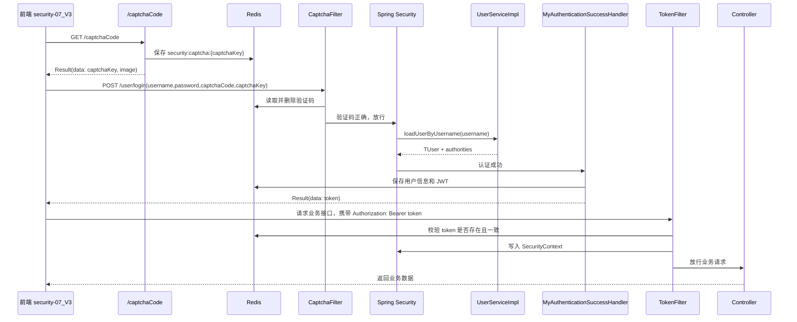

# Spring Security 学习项目

这个仓库是学习 B 站 UP 主“动力节点”的 Spring Security 框架课程时整理的代码练习项目。仓库按学习阶段拆成多个模块，每个模块对应一个关键知识点或一次登录认证能力升级。

课程 PDF 笔记提供了基础学习路线，但本仓库最终实现和 PDF 中的部分写法不完全一致。尤其是最后的前后端分离登录认证，本项目以当前代码为准，最终目标是梳理并实现：

```text
Spring Security + JWT + 图形验证码 + Redis + 前后端分离登录认证
```

## 项目结构

```text
.
├── security-01-base                  # Spring Security 基础入门
├── security-02-db-login              # 基于数据库查询用户登录
├── security-03-capticha              # 前后端不分离验证码登录
├── security-04-loginInfo             # 获取当前登录用户信息
├── security-05-role-permission       # 基于角色/权限的访问控制
├── security-06-code-permissions      # 基于权限标识 code 的权限控制
├── security-07-ogin-api              # 前后端分离登录接口初版
├── security-07_V3                    # 前端页面，配合最终 JWT 后端使用
└── security-08-login-jwt             # 最终后端：JWT + Redis + 验证码 + 权限
```

前几个模块主要是前后端不分离场景，使用 Thymeleaf 页面和 Session 登录流程；后面的模块逐步切换到前后端分离，最终由 `security-08-login-jwt` 提供后端接口，`security-07_V3` 提供前端页面。

## 技术栈

- Java 17
- Spring Boot
- Spring Security
- MyBatis
- MySQL
- Redis
- Hutool Captcha / JWT
- Vue 3
- Element Plus
- Axios

## 学习路线

### 1. Spring Security 基础

`security-01-base` 用来理解 Spring Security 的默认行为：

- 引入 `spring-boot-starter-security` 后，接口默认都会被保护。
- 未登录访问接口会被重定向到默认登录页。
- Spring Security 的核心是过滤器链，入口是 `FilterChainProxy`。

### 2. 数据库登录

`security-02-db-login` 开始把用户信息放到数据库中，核心是实现：

```java
UserDetailsService.loadUserByUsername(String username)
```

Spring Security 登录时会通过 `UsernamePasswordAuthenticationFilter` 接收账号密码，然后调用 `UserDetailsService` 查询用户，再由框架完成密码匹配和用户状态校验。

### 3. 验证码登录

`security-03-capticha` 到 `security-06-code-permissions` 主要还是前后端不分离写法。验证码图片直接由后端输出，验证码答案放在 Session 中，登录时通过自定义 `CaptchaFilter` 在用户名密码过滤器之前校验。

这个阶段的核心顺序是：

```text
CaptchaFilter
  -> UsernamePasswordAuthenticationFilter
  -> UserDetailsService
  -> PasswordEncoder
  -> 登录成功/失败处理
```

### 4. 角色和权限控制

`security-05-role-permission` 和 `security-06-code-permissions` 重点学习授权：

- `hasRole(...)`
- `hasAuthority(...)`
- `hasAnyAuthority(...)`
- `@PreAuthorize(...)`

最终模块中使用的是权限标识 code，例如：

```java
@PreAuthorize("hasAuthority('clue:add')")
@PreAuthorize("hasAuthority('clue:edit')")
@PreAuthorize("hasAnyAuthority('clue:admin','clue:delete')")
@PreAuthorize("hasAuthority('clue:view')")
```

### 5. 前后端分离和 JWT

前后端分离后，后端不再依赖 Session 记录登录状态：

```java
session.sessionCreationPolicy(SessionCreationPolicy.STATELESS)
```

这样登录成功后不能再靠 Session 判断用户是否已登录，所以需要使用 JWT。前端登录成功后保存 token，后续每次请求都在请求头中带上：

```http
Authorization: Bearer <token>
```

后端通过自定义 `TokenFilter` 校验 JWT，并把认证信息重新放入 Spring Security 上下文。

## 最终模块说明

最终后端模块：

```text
security-08-login-jwt
```

最终前端模块：

```text
security-07_V3
```

最终实现包含：

- 登录接口：`POST /user/login`
- 验证码接口：`GET /captchaCode`
- 退出接口：`POST /user/logout`
- 用户信息接口：`GET /welcome2`
- 权限测试接口：`/api/clue/**`
- JWT 生成和校验
- Redis 保存登录 token
- Redis 保存图形验证码
- 统一返回对象 `Result<T>`
- 全局异常处理
- Spring Security 401 / 403 JSON 返回

## 最终登录流程

### 1. 前端加载验证码

登录页是：

```text
security-07_V3/index.html
```

页面加载时调用：

```http
GET http://localhost:8080/captchaCode
```

后端生成图形验证码，并返回统一结构：

```json
{
  "code": 200,
  "message": "success",
  "data": {
    "captchaKey": "uuid",
    "image": "data:image/gif;base64,..."
  }
}
```

前端把 `image` 放到 `` 的 `src` 上显示，把 `captchaKey` 暂存在表单对象中。

### 2. 后端生成验证码并写入 Redis

验证码接口在：

```text
security-08-login-jwt/src/main/java/com/franco/controller/UserController.java
```

核心逻辑：

```text
生成验证码图片
生成 captchaKey
Redis 写入：security:captcha:{captchaKey} -> 验证码答案
设置 2 分钟过期时间
返回 captchaKey 和 base64 图片
```

这里没有使用 Session。原因是最终模块是前后端分离 + JWT 的无状态登录模式，验证码如果继续放 Session，会重新引入 Cookie 和 `JSESSIONID` 的跨域问题。

### 3. 前端提交登录

用户输入账号、密码、验证码后，前端请求：

```http
POST http://localhost:8080/user/login
Content-Type: application/x-www-form-urlencoded

username=zhangqi
password=aaa111
captchaCode=1234
captchaKey=uuid
```

注意：`/user/login` 不是自己写的 Controller 接口，而是 Spring Security 的登录处理地址，由 `UsernamePasswordAuthenticationFilter` 处理。

### 4. CaptchaFilter 校验验证码

验证码过滤器在：

```text
security-08-login-jwt/src/main/java/com/franco/filter/CaptchaFilter.java
```

它被配置在 `UsernamePasswordAuthenticationFilter` 前面：

```java
.addFilterBefore(captchaFilter, UsernamePasswordAuthenticationFilter.class)
```

登录请求会先进入 `CaptchaFilter`：

```text
读取 captchaKey 和 captchaCode
根据 security:captcha:{captchaKey} 从 Redis 取出正确答案
取出后立刻删除 Redis 中的验证码
比较用户输入和 Redis 中的验证码
验证码错误则返回 Result.fail(400, ...)
验证码正确则放行
```

验证码校验成功后才会继续进入 Spring Security 的用户名密码认证流程。

### 5. Spring Security 校验账号密码

验证码通过后，请求进入：

```text
UsernamePasswordAuthenticationFilter
```

然后调用：

```text
UserServiceImpl.loadUserByUsername(username)
```

代码位置：

```text
security-08-login-jwt/src/main/java/com/franco/service/impl/UserServiceImpl.java
```

这个方法会：

```text
根据 loginAct 查询用户
根据用户 id 查询权限列表
把权限列表放入 TUser
返回实现 UserDetails 的 TUser
```

`TUser#getAuthorities()` 会把数据库权限 code 转成 Spring Security 识别的 `GrantedAuthority`。

### 6. 登录成功生成 JWT

登录成功后进入：

```text
MyAuthenticationSuccessHandler
```

代码位置：

```text
security-08-login-jwt/src/main/java/com/franco/handler/MyAuthenticationSuccessHandler.java
```

它会做几件事：

```text
获取当前登录用户 TUser
生成 JWT
Redis 保存用户信息
Redis 保存 token
返回 token 给前端
```

Redis 中主要保存：

```text
security:user:info{userId}   -> 用户 JSON
security:user:token:{userId} -> JWT
```

返回示例：

```json
{
  "code": 200,
  "message": "login success",
  "data": {
    "token": "eyJ..."
  }
}
```

### 7. 前端保存 token

前端登录成功后，从响应中取：

```js
result.data.data.token
```

然后保存到：

```js
window.sessionStorage.setItem("token", token);
```

这里使用 `sessionStorage`，关闭当前标签页后 token 会消失，安全性比长期保存在 `localStorage` 稍好。

### 8. 前端访问受保护接口

登录成功后跳转到：

```text
security-07_V3/wellCom.html
```

页面会请求：

```http
GET http://localhost:8080/welcome2
Authorization: Bearer <token>
```

访问线索接口时也会带上同样的请求头：

```http
GET http://localhost:8080/api/clue/list
Authorization: Bearer <token>
```

### 9. TokenFilter 校验 JWT

JWT 过滤器在：

```text
security-08-login-jwt/src/main/java/com/franco/filter/TokenFilter.java
```

它的职责是：

```text
放行 OPTIONS 请求
放行 POST /user/login
放行 GET /captchaCode
读取 Authorization 请求头
检查 Bearer 格式
验证 JWT 签名
解析 userId
从 Redis 取 token
比较前端 token 和 Redis token 是否一致
从 Redis 取用户信息
重新查询用户权限
构造 UsernamePasswordAuthenticationToken
写入 SecurityContextHolder
放行请求
```

其中最关键的是这一步：

```java
SecurityContextHolder.getContext().setAuthentication(authentication);
```

这表示当前请求已经被认证。后面的 Controller 和 `@PreAuthorize` 才能识别当前用户是谁、拥有什么权限。

### 10. 权限注解校验

权限测试接口在：

```text
security-08-login-jwt/src/main/java/com/franco/controller/ClueController.java
```

示例：

```java
@PreAuthorize("hasAuthority('clue:add')")
@RequestMapping("/add")
public String add() {
    return "线索录入";
}
```

如果当前用户没有 `clue:add` 权限，会返回统一 403 JSON：

```json
{
  "code": 403,
  "message": "权限不足",
  "data": null
}
```

## 最终流程图



## 统一返回结构

统一返回类：

```text
security-08-login-jwt/src/main/java/com/franco/result/Result.java
```

结构：

```json
{
  "code": 200,
  "message": "success",
  "data": {}
}
```

常见返回：

```json
{
  "code": 401,
  "message": "Token无效或已过期",
  "data": null
}
```

```json
{
  "code": 400,
  "message": "验证码错误",
  "data": null
}
```

```json
{
  "code": 403,
  "message": "权限不足",
  "data": null
}
```

## 统一异常处理

全局异常处理类：

```text
security-08-login-jwt/src/main/java/com/franco/handler/GlobalExceptionHandler.java
```

处理内容：

- `IllegalArgumentException`：返回 400
- `AccessDeniedException`：返回 403
- 其他异常：返回 500

Spring Security 自己抛出的未登录和无权限异常不完全走 Controller 层异常处理，所以在 `SecurityConfig` 中也配置了：

- `authenticationEntryPoint`：未登录返回 401
- `accessDeniedHandler`：权限不足返回 403

## 核心配置

最终安全配置在：

```text
security-08-login-jwt/src/main/java/com/franco/config/SecurityConfig.java
```

关键配置：

```java
.csrf(csrf -> csrf.disable())
.cors(cors -> cors.configurationSource(corsConfigurationSource()))
.sessionManagement(session ->
    session.sessionCreationPolicy(SessionCreationPolicy.STATELESS))
.formLogin(formLogin -> formLogin
    .loginProcessingUrl("/user/login")
    .successHandler(myAuthenticationSuccessHandler)
    .failureHandler(myAuthenticationFailureHandler)
    .permitAll())
.logout(logout -> logout
    .logoutUrl("/user/logout")
    .logoutSuccessHandler(appLoutSuccessHandler)
    .permitAll())
.authorizeHttpRequests(auth -> auth
    .requestMatchers(HttpMethod.OPTIONS, "/**").permitAll()
    .requestMatchers("/", "/captchaCode").permitAll()
    .requestMatchers(HttpMethod.POST, "/user/login").permitAll()
    .anyRequest().authenticated())
.addFilterBefore(captchaFilter, UsernamePasswordAuthenticationFilter.class)
.addFilterBefore(tokenFilter, LogoutFilter.class)
```

## 运行说明

### 1. 启动依赖服务

需要本地启动：

- MySQL
- Redis

后端配置文件：

```text
security-08-login-jwt/src/main/resources/application.yml
```

默认配置：

```yaml
spring:
  datasource:
    url: jdbc:mysql://localhost:3306/security_db
    username: root
    password: 2005

  data:
    redis:
      host: localhost
      port: 6379
```

如果本地数据库账号、密码、库名不同，需要先修改这里。

### 2. 启动后端

进入最终后端模块：

```bash
cd security-08-login-jwt
mvn spring-boot:run
```

后端默认端口：

```text
http://localhost:8080
```

### 3. 打开前端

前端目录：

```text
security-07_V3
```

可以直接打开：

```text
security-07_V3/index.html
```

登录成功后会跳转：

```text
security-07_V3/wellCom.html
```

当前前端请求地址写死为：

```text
http://localhost:8080
```

## 重要接口

### 获取验证码

```http
GET /captchaCode
```

返回：

```json
{
  "code": 200,
  "message": "success",
  "data": {
    "captchaKey": "...",
    "image": "data:image/gif;base64,..."
  }
}
```

### 登录

```http
POST /user/login
```

参数：

```text
username
password
captchaCode
captchaKey
```

返回：

```json
{
  "code": 200,
  "message": "login success",
  "data": {
    "token": "..."
  }
}
```

### 获取当前用户

```http
GET /welcome2
Authorization: Bearer <token>
```

### 退出登录

```http
POST /user/logout
Authorization: Bearer <token>
```

### 线索权限接口

```http
GET /api/clue/list
GET /api/clue/add
GET /api/clue/edit
GET /api/clue/delete
GET /api/clue/view
```

除 `/list` 外，其余接口需要对应权限 code。

## PDF 与当前项目的差异

课程 PDF 中的验证码登录先采用的是前后端不分离思路：

```text
验证码答案 -> Session
登录失败 -> 跳转页面
登录成功 -> 服务端 Session 记录状态
```

本项目最终实现是前后端分离思路：

```text
验证码答案 -> Redis
登录失败 -> JSON
登录成功 -> JWT
登录状态 -> 前端 token + 后端 Redis token
接口认证 -> TokenFilter 写入 SecurityContext
```

因此 README 中最终流程以当前项目为准。

## 学习重点总结

这个仓库最终想掌握的不是单个 API，而是完整认证链路：

1. Spring Security 不是只靠 Controller 登录，而是由过滤器链处理登录。
2. `/user/login` 是 Spring Security 登录处理地址，不需要自己写 Controller。
3. 验证码应该在用户名密码认证之前校验，所以要放在 `UsernamePasswordAuthenticationFilter` 前。
4. 前后端分离后不再依赖 Session，所以登录成功后要返回 JWT。
5. JWT 不能只发给前端，还要在 Redis 中保存一份，用于服务端主动控制 token 是否有效。
6. 后续请求必须带 `Authorization: Bearer <token>`。
7. 后端每次请求都要通过 `TokenFilter` 校验 token，并把用户认证信息写入 `SecurityContextHolder`。
8. 权限注解依赖 `Authentication` 中的 `authorities`，所以 JWT 认证恢复用户时也必须恢复权限。
9. 统一返回结构可以减少前端判断成本。
10. Spring Security 的 401/403 需要单独配置处理器，不能只依赖全局异常处理。

